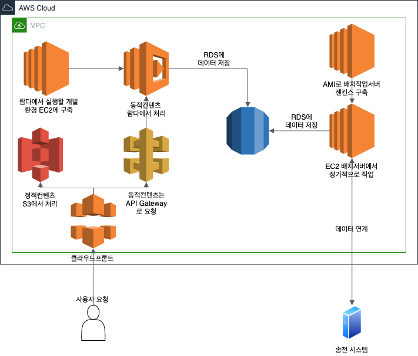

> EC2를 사용하지 않고 신속하게 구축하기
> 실행 기반을 람다로 구현하기

EC2를 사용하지 않고 웹 시스템을 구축해 서버를 관리할 필요 없이 애플리케이션 개발에 집중할 수 있다. AWS Lambda와 Amazon API Gateway가 핵심이다.

단기간에 많은 시스템을 구축해야하는 신규 사업의 경우 클라우드가 안성맞춤이다. 단순히 EC2같은 가상 서버를 빌리고 그 위에 애플리케이션과 미들웨어를 설치하는 것으론 시스템 구축 기간을 획기적으로 단축시키기 어렵다. 서버 구축 시간이 짧아질 뿐이다.

서버리스를 사용하면 온프레미스와 연계나 기존 시스템과 아키텍처 일관성도 고려할 필요가 없어 설계가 단순해진다.

인프라 핵심 설계 사항

1. 서버리스(동적 컨텐츠) : AWS 람다와 아마존 API Gateway를 이용해 동적 컨텐츠 구축
2. 서버리스(정적 컨텐츠) : 아마존 클라우드프론트와 아마존 S3를 이용해 가상 서버를 사용하지 않고 정적 컨텐츠를 배포
3. AMI의 활용 : 소프트웨어가 설치된 머신 이미지를 활용해 서버를 신속하게 설치해 구축 기간 단축

## 서버리스 포털 사이트 구축하기

포털 사이트는 AWS 람다, 아마존 API 게이트웨이, 아마존 클라우드프론트, 아마존 S3의 조합으로 구현한다.

핵심은 송전 사업자와 데이터 연계를 제외하면 가상 서버 EC2를 사용하지 않는다는 것이다. 관리형 서비스 뒤에선 서버가 움직이고 있지만 서버를 AWS가 관리하게 해서 인프라 설계 및 운영에 할애하는 자원을 최소화했다.

람다는 이벤트 발생에 따라 임의의 프로그램을 실행하는 관리형 서비스이고 API 게이트웨이는 AWS 환경에서 REST API를 정의하여 요청을 처리하는 관리형 서비스이다. 이 두 서비스를 이용하면 REST API 호출에 대응하는 시스템을 만들 수 있다.

API 게이트웨이는 데이터를 유지할 수 없기 때문에 관리형 RDS인 아마존 RDS에 데이터를 저장한다.

클라우드프론트는 CDN(Contents Delivery Network) 서비스로서 전 세계에 배치된 서버가 컨텐츠를 캐시하고 전달한다. 그리고 S3는 관리형 객체 스토리지 서비스로 저렴한 가격에 대량의 데이터를 저장할 수 있다. 클라우드프론트와 S3를 결합해 S3에 저장한 리치 미디어를 클라우드프론트에 전달해 저렴하게 정적 컨텐츠를 제공할 수 있다.

이렇게 정적 컨텐츠를 전달하면 EC2를 이용해 웹 서버를 구축할 필요가 없고 설계 및 유지 보수, 운영 시간을 절약할 수 있다. 또한 캐시와 액세스가 증가했을 때 클라우드프론트를 사용해 스케일-아웃 할 수 있다.

송전 사업자와 데이터 연계는 EC2를 사용한다. 송전 사업자의 요금 데이터를 검색해 수정하고 집계 배치 서버와 배치 서버에 지시를 내리는 작업 관리 서버가 필요한데, 작업 관리 서버는 아마존 AMI를 사용했다. AMI는 미들웨어와 애플리케이션이 설치된 OS 이미지로 AWS와 사용자 커뮤니티, 소프트웨어 공급 업체를 통해 제공된다. AMI 템플릿으로 EC2 인스턴스를 시작하면 미들웨어 및 애플리케이션의 설계와 구현 없이 환경을 제공할 수 있다.

## 람다와 API 게이트웨이로 웹 서비스 만들기

람다와 API 게이트웨이를 사용하면 운영 관리에 드는 수고를 줄일 수 있다. 예를들어 트래픽이 증가하는 경우 사용자 측에서 서버 추가를 할 필요 없이 AWS가 관리해준다. 따라서 트래픽 예측이 어려운 신규 사업에 유용하다.

람다와 API 게이트웨이를 조합한 패턴을 사용하지 않으면 EC2에 웹 서버를 여러 대 준비하고 ELB로 부하를 분산하는 방법을 주로 사용한다. 하지만 이런 경우 웹 서버를 설치하고 OS와 웹 서버를 소프트웨어 패치 적용과 모니터링 같은 운영도 해야 한다.

사용자는 API 게이트웨이에서 정의한 리소스에 접속한다. 접속할 대상을 **리소스 패스**라고 하고, 리소스를 조작하는 대상을 **메소드**, 요청을 수행할 대상을 **백엔드**라고 한다.

요금 명세서를 bill이란 이름의 리소스를 작성한다면, `/bill`은 리소스 패스이다. 이때 사용자는 `https://<my-api-id>.execeute-api.ap-northeast-2.amazonaws.com/prod/bill`  로 요청을 보내는데 이것을 엔드 포인트라고 한다. my-api-id는 AWS 루트 계정마다 주어진 고유한 식별자이다.

엔드 포인트에 GET 요청을 보내면 GET 메소드를 실행하는 백엔드를 호출한다. 여기선 람다 함수가 지정되어있다. 람다는 실행 결과를 API 게이트웨이에 반환하고 세션 상태에 추가되어 사용자에게 반환된다.

API 게이트웨이는 백엔드 호출 이외에도 인증 캐시, 세션 상태 관리, API 실행 상태 모니터링 및 로깅 기능도 있다. 또한 배포 관리 기능도 있어서 여러 배포 환경(스테이지)을 지정할 수도 있다. `/prod/리소스명`, `/dev/리소스명` 과 같이 URL로 분리된다.

API 게이트웨이를 사용하는 경우 Stateful API가 아닌 Stateless API로 설계하도록 주의해야 한다.

## 람다 함수의 작성과 실행

먼저 람다 함수를 생성한다. 람다 함수는 Node.js, Java, Python, .NET Core로 작성할 수 있다. MySQL과 같이 외부 라이브러리가 필요한 경우 작성한 프로그램과 라이브러리를 zip으로 압축해서 업로드한다.

다음으로 람다 함수를 실행한다. API 게이트웨이 호출과 같은 실행 이벤트가 있을 때 AWS 컴퓨팅 자원 위에서 프로그램이 실행된다. 부하가 많아지는 경우 자동으로 확장되어 사용자는 신경 쓸 필요가 없다.

## 람다 함수 사용 시 유의사항

람다 함수는 단기간에 끝나는 가벼운 작업을 많이 수행하는 경우 적합하고 오랜 시간이 걸리는 작업에는 적합하지 않다. 또한 상태를 저장하지 않기 때문에 전후 작업에 종속적인 경우에도 적합하지 않다. 실행 시간이 길거나 상태 저장이 필요한 경우엔 EC2 인스턴스에 서버를 구축해야 한다.

빠른 응답 속도가 필요한 경우에도 적합하지 않다. 매번 컨테이너에서 시작, 종료하기 때문이다. 웹 서버에선 프로세스가 대기하고 있지만 람다에선 매번 데이터베이스를 연결해야 하기 때문에 오버헤드가 발생해 실행 시간이 길어진다.

람다 함수의 Timeout 기본값은 3초로 1초에서 900초까지 지정할 수 있다.

람다 함수엔 JSON 형식으로 매개변수를 전달해야 한다. 람다 함수 단독으론 REST API를 만들 수 없고 API 게이트웨이를 통해 받은 매개변수를 JSON으로 변환해서 람다 함수에 전달해야 한다.

## API 게이트웨이와 람다의 요금 체계

API 게이트웨이는 요청 횟수, 람다는 처리 시간에 따라 요금 체계가 달라진다.

## AMI로 즉시 미들웨어 구축하기

전력 소매 사업은 송전 사업자와 데이터를 교환한다. 람다는 가벼운 처리를 전제로 하기 때문에 큰 데이터를 처리하는 용도로는 적합하지 않다. 따라서 EC2에 배치 서버를 구현해 데이터를 처리한다.

이렇게만 해도 시스템이 완성되지만, 배치 서버의 EC2 인스턴스는 처리 능력이 높은 대신 요금이 비싸다. 필요한 경우엔 EC2 인스턴스를 중지하는 것으로 운영 비용을 최적화 할 수 있다. 따라서 배치 서버의 실행, 중지를 관리할 작업 관리 서버를 별도로 설치한다. 이 작업은 AMI를 사용해 작업 관리 서버의 구축 시간을 단축한다.

AMI의 종류엔 퀵 스타트, 커뮤니티 AMI, AWS 마켓 플레이스가 있다.

- 퀵 스타트 : AWS가 제공하는 간단하고 일반적인 AMI. OS와 AWS CLI 환경만 제공되며 미들웨어와 애플리케이션은 설치되어 있지 않다.
- 커뮤니티 AMI : 커뮤니티나 기업이 만들어 공개하는 AMI. AWS가 지원하는 것이 아니라서 신뢰 여부는 사용자가 판단해야 한다.
- AWS 마켓 플레이스 : 소프트웨어 개발사나 퍼블리셔가 제공하는 AMI. 용도에 맞춰 설정되어 있어서 즉시 머신 이미지를 이용할 수 있다. 라이센스 비용은 AWS 사용료와 함께 지불할 수 있어서 계약 절차가 간소화되어 있다.