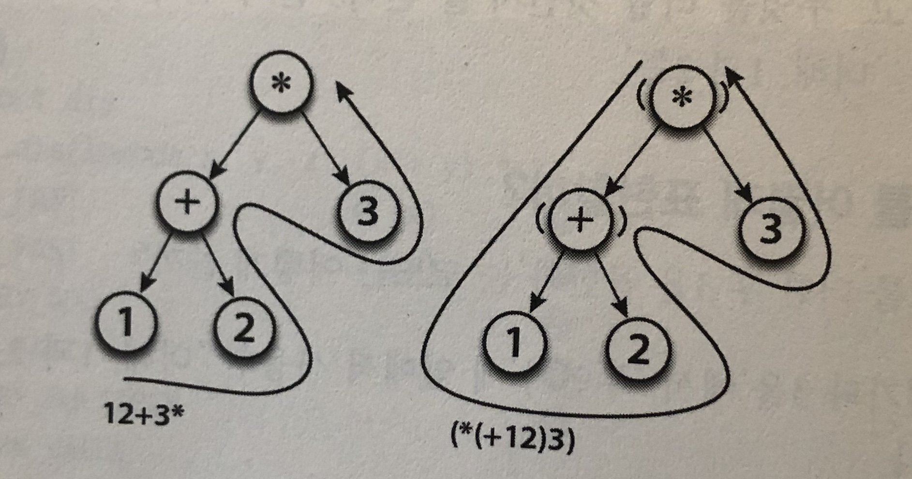

## 문법
문법은 언어 설계자가 정한 규칙이다.
FORTH는 문법이 거의 존재하지 않는 언어이다. FORTH는 스택을 사용해 연산한다.
```
1 2 + 3 *
```
최근엔 FORTH와 같은 스택 기반의 언어를 잘 사용하지 않는다. 다만, 스택 머신의 형태인 VM(Virtual Machine)을 사용한다. Java, Ruby, Python 등의 언어는 프로그램 내부적으로 FORTH와 같은 프로그램으로 컴파일되어 동작한다.

LISP은 구역을 구분하기 위해 괄호를 사용했다.
```
(* (+ 1 2) 3)
```
두 언어는 표현은 다르지만 동일한 구조를 사용해 '하고자 하는 것'을 표현했다. 아래처럼 구문트리의 구조가 같다.



LISP처럼 연산자가 앞에 오는 것을 **전위 표기법**, FORTH처럼 연산자가 뒤에 오는 것을 **후위 표기법**, 사람들이 익숙한 방법인 연산자가 가운데에 오는 것을 **중위 표기법**이라한다.
FORTRAN이란 언어는 **중위 표기법**을 적용해 인기를 끌었다.

## 구문 분석기(Parser)
파서는 소스 코드를 문자열로 읽어 해석한 뒤 구문 트리로 만드는 프로그램이다. 문법 설계와 파서 구현은 프로그래밍 언어의 외관을 결정하는 중요한 요소이다.

파싱 방법에 따라 어떤 규칙을 적용해야 애매한 부분 없이 분석할 수 있는지가 달라진다. 또한 기존의 언어에 새로운 기능을 추가할 때는 기존의 규칙과 충돌해 문제를 일으키기도 한다.

## 정리
'어떤 문자열을 쓰면 어떤 구문트리가 생기는가'라는 규칙이 문법이다.
대부분의 프로그래밍 언어는 FORTRAN처럼 쉬운 작성법을 목표로 하지만 모순 없이 해석할 수 있는 문법을 만들어 내는 것은 어려운 일이다. 특히 기존 언어에 새로운 문법이 추가될 때는 더욱 그렇다. 프로그램을 짤 때 작성법이 어렵다고 느끼는 것은 이것 때문이다.