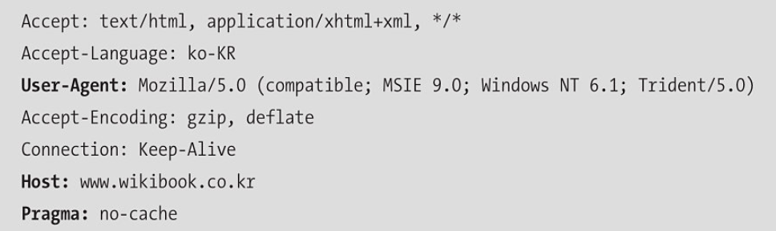
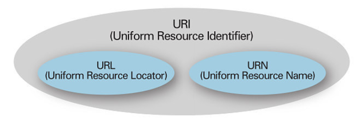
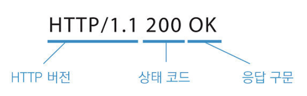
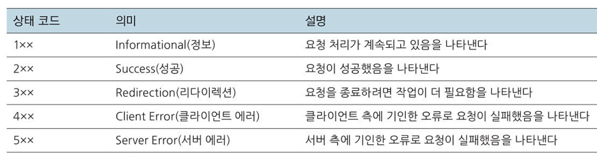
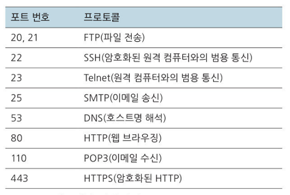
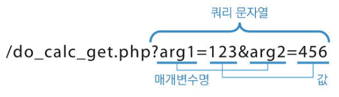

## HTTP 요청

#### 요청 라인
HTTP 요청 헤더의 첫 부분을 요청 라인이라고 한다. 요청 라인은 HTTP 요청에서 가장 중요한 부분이다.

#### 메서드
요청의 종류를 나타낸다. 메서드에 해당하는 요청을 보낸다.
#### URI
'어떤 정보를 원하는 지'를 나타낸다.
#### HTTP 버전
HTTP의 버전을 나타낸다. 버전에 따라 이용할 수 있는 메소드의 종류가 달라진다.

### 요청 메시지 헤더

1. **Accept**
웹 클라이언트가 받을 수 있는 데이터의 종류를 Content-Type 형식으로 나타낸다. 웹의 세계에선 HTTP로 통신하기만 하면 어떤 소프트웨어든 웹 클라이언트가 될 수 있기 때문에 Accept에서 지정한 형식을 통해 필요한 정보만 받을 수 있다.
2. **Accept-Language**
웹 클라이언트가 받을 수 있는 자연 언어의 종류를 나타낸다. 같은 컨텐츠가 영문판과 한글판이 있는 경우 Accept-Language를 통해 언어에 맞는 컨텐츠를 보낼 수 있다.
3. **User-Agent**
사용자가 이용중인 웹 브라우저의 종류와 버전을 나타낸다.
4. **Host**
요청을 보낸 곳의 호스트 명과 포트 번호를 나타낸다.

> **URI와 URL**

 URL은 주소이기 때문에 호스트가 변경될 경우 변경된 URL을 모를 경우 접속할 수 없다. 이를 해결하기 위해 **리소스에 통일된 이름** 을 정한 것이 URN이다. 문서가 어떤 위치에 존재하든 같은 URN으로 표시할 수 있다. URI는 URL과 URN을 포함해서 표현하는 것이다.

 ## HTTP 응답

 #### 상태 라인
 HTTP 응답의 첫 부분을 상태 라인이라고 한다.

상태 코드를 통해 요청의 성공 유무를 알 수 있다. 응답 구문은 상태 코드에 해당하는 내용을 설명해준다.

### 응답 메시지 헤더
응답에 대한 부가적인 정보가 담겨있다.

### 응답 메시지 본문
요청한 데이터가 바이너리 형식으로 본문에 저장되어있다.

## IP주소

인터넷에 접속된 모든 컴퓨터는 IP주소라는 주소로 식별된다. IP주소는 0부터 255까지를 나타낸 수 4개의 조합으로 약 43억개의 주소를 나타낼 수 있다.

## TCP/IP

TCP/IP는 클라이언트로부터 받은 HTTP 요청 등의 정보를 패킷으로 **분할해 송신** 한다. 수신한 쪽에선 패킷을 다시 조립해 웹 서버의 애플리케이션으로 넘긴다.

패킷을 한번에 보내면 중간에 실패하면 처음부터 다시 보내야 하기 때문에 분할해서 보낸다.

## DNS

**DNS(Domain Name System)** 은 DNS서버를 통해 도메인 명에 대응하는 IP주소를 반환해준다. google.com은 google과 com이라는 두 계층으로 나눠진다. 

com, net, kr같은 최상위 도메인을 **TLD(Top Level Domain)** 라고 한다. 이러한 TLD의 DNS서버를 **루트 서버** 라고 한다. 루트 서버부터 하위 DNS서버에 질의해 나가며 원하는 호스트 명의 IP주소를 얻을 수 있다.

## 포트번호

포트번호는 수신한 정보가 어떤 프로토콜이고, 어떤 애플리케이션에서 처리해야 하는지를 나타내준다. TCP/IP를 통해 정보를 수신하는 애플리케이션은 수신 대기 포트를 결정하고 기다린다. 대표적인 프로토콜들이 사용하는 포트를 **Well-known Port** 라고 한다.

## 웹 서버 요청

#### GET
웹 서버에 GET 메소드로 요청하는 경우 URL에 매개변수가 포함되어 전송된다.

URL의 ? 이후 부분을 **쿼리 문자열**이라 하고, 매개변수를 &로 구분한다.

- URL에 정보가 포함되어 보안이 나쁘다.
- URL에 정보가 포함되어 매개변수를 기억하거나 다른 사람에게 전달할 때 편리하다.
- 같은 요청을 반복해도 같은 결과를 얻는다. 즉, **부작용이 없다.**

#### POST
GET과 달리 매개변수가 URL이 아닌 **메시지 본문** 에 담겨있다. 매개변수를 전달하는 방법이 다를 뿐 사용자에겐 차이가 없다.

- URL에 노출되지 않아 보안이 상대적으로 좋다
- 메시지 본문엔 길이 제한이 없어 매개변수의 양이 많아도 길이 걱정할 필요가 없다.
- URL에 정보가 없어서 결과를 저장해놓고 다음에 볼 수 없다.