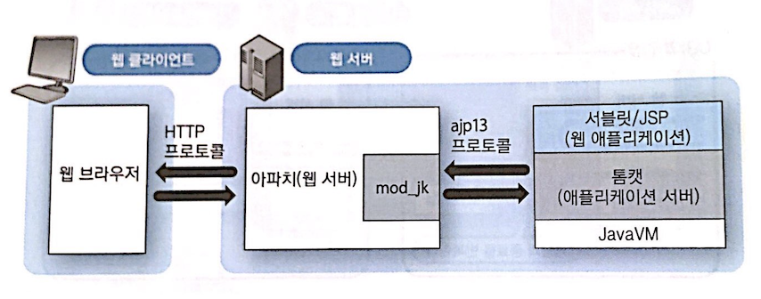
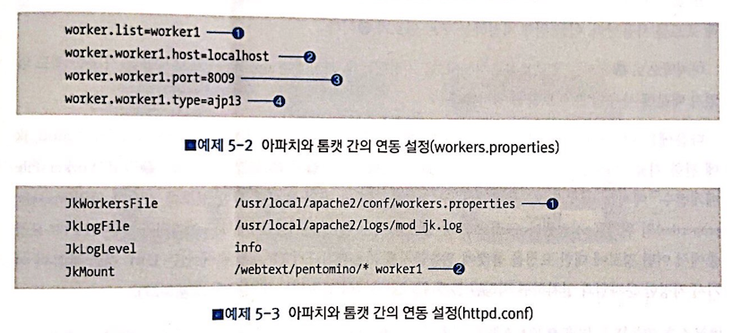

## 웹 애플리케이션의 구성 요소

시스템의 물리적인 서버는 규모에 따라 달라진다. 하지만 논리적인 서버는 웹 서버와 애플리케이션 서버, 데이터베이스 서버로 나누어진다.

## 웹 서버와 애플리케이션 서버의 연동

서로 다른 프로세스라서 통신을 해야 하는데 표준이 정해져 있진 않다. 일반적으로 애플리케이션 서버 측이 웹 서버별로 **모듈** 을 마련하고, 웹 서버가 그 모듈을 탑재해서 연동을 한다.

톰캣은 아파치 서버용으로 **mod_jk** 라는 모듈을 제공한다. 아파치는 HTTP 요청을 mod_jk를 통해 톰캣으로 전송한다. 아파치에서 톰캣으로 전송할 때는 **ajp13** 이라는 톰캣 고유의 프로토콜을 사용한다.

웹 서버와 애플리케이션 서버를 연동할 경우, 정적 콘텐츠로만 구성된 페이지는 웹 서버가 담당하고 동적 콘텐츠는 애플리케이션 서버가 담당한다.

웹 서버는 애플리케이션 서버로 전송해야 할 URL을 톰캣 설정파일을 통해 알려준다. worker1이라는 **톰캣 워커** 를 정의하고 **JkMount** 를 통해 어떤 경로에 있는 요청을 톰캣으로 전송할지 설정한다.

웹 서버와 애플리케이션 서버를 서로 다른 노드에 배치할 경우 시스템의 규모가 커진다.
하지만 역할 분담이 확실해진다. 웹 서버는 요청에 대한 처리량이 적은 대신 요청의 수가 매우 많다. 애플리케이션 서버는 처리량이 많은 대신 요청의 수는 적다. 서버를 분리해 다른 성격의 요청을 적절히 분담할 수 있고 필요에 따라 유연한 구성이 가능하다.

## 애플리케이션 서버가 제공하는 기능

### 세션 관리

세션 ID의 발행과 관리를 해준다.

### 트랜잭션 관리

업무상 함께 실행돼야 하는 일련의 처리를 **트랜잭션** 이라고 한다. 트랜잭션은 포함된 처리를 모두 성공해야 한다. 어느 하나라도 실패할 경우 **롤백** 된다.

### 데이터베이스 접속 관리

매번 SQL을 작성할때마다 데이터베이스에 접속하지 않고 웹서버를 통해 일괄 관리한다. 애플리케이션 서버가 접속을 관리해주기 때문에 개발자들은 접속 상태를 신경쓰지 않아도 된다.

### 시스템의 가용성 향상

애플리케이션 서버가 다운되는걸 방지하기 위해 여러 대의 애플리케이션 서버를 준비해 다운된 서버의 처리를 맡긴다. 이때 **세션 복제(Session Replication)** 를 통해 세션 상태를 공유한다.

## 웹 시스템의 삼층 구성

웹 시스템의 서버 사이드에서 웹 서버, 애플리케이션 서버, 데이터베이스 서버 3가지는 반드시 필요하다. 규모에 따라 하나의 노드에 전부 배치하느냐 여러 노드에 분산해 배치하느냐가 달라질 뿐이다.