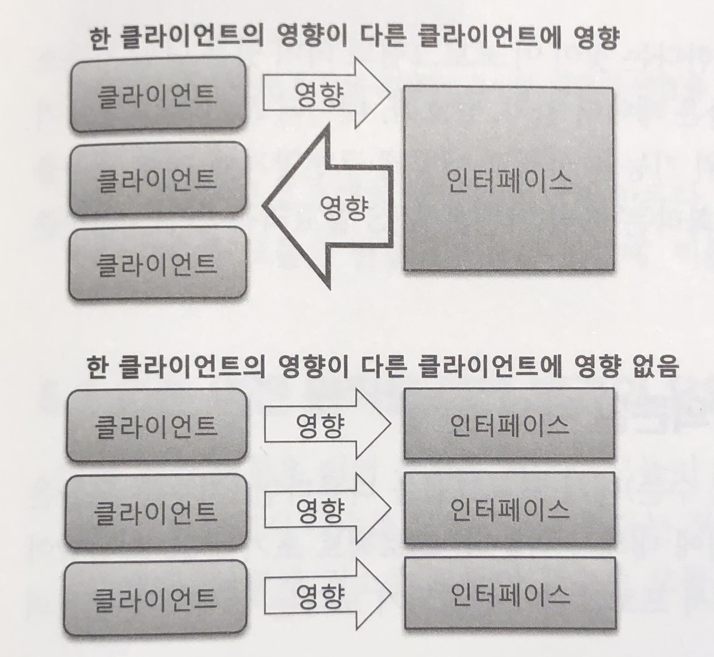

## 단일책임원칙 SRP

> 클래스는 단 하나의 책임을 가져야 한다.

#### SRP를 어겼을때 문제

- **책임이 여러개면 데이터 타입의 변화로 인해 연쇄적으로 코드를 변경해야한다.**

    책임이 늘어날 수록 변화가 다른 책임에 주는 영향은 비례해서 증가한다.      
    저수준의 타입(ex String)이 아닌 추상화된 타입(ex DataLoader)을 사용한다면 데이터를 읽어오는 부분의 변경때문에 화면을 보여주는 부분의 코드가 변경되는 상황을 막을 수 있음.

- **재사용이 어려워진다.**

    책임이 분리되어있지 않아 실제로 사용하지 않는 기능의 jar파일까지 필요하다.

책임의 단위는 변화되는 부분과 관련된다. 변화되는 기능이 별도로 분리되어야 할 책임이다.

단일책임원칙을 지키는지 확인해보려면 메소드를 실행하는 것이 누구인지 확인해본다.

클래스의 사용자(다른 클래스)들이 서로 다른 메소드들을 사용한다면 각각 다른 책임을 할 가능성이 높고 책임 분리 후보가 될 수 있다.

## 개방폐쇄원칙 OCP

> 기능을 변경하거나 확장할 수 있으면서 기능을 사용하는 코드는 수정하지 않아야 한다.

#### OCP를 구현하는 방법

- 확장되는 부분을 인터페이스로 추상화해 콘크리트 클래스로 구현한다.
- 확장되는 부분을 상속으로 변경해 하위 클래스에서 구현한다.

#### OCP가 깨진 경우

- instanceof와 같은 타입확인 연산자를 사용한 경우

    특정 타입만 처리하는 것이기 때문에 OCP를 지키지 않았을 가능성이 높다. 특정 타입만 처리하는 코드가 변화 가능성이 있다면 추상화해서 상위 클래스나 인터페이스에 추가해야 한다.

- 비슷한 if-else 블록이 있는 경우

    새로운 기능마다 if 블록이 추가되므로 OCP가 지켜지지 않는다. 인터페이스로 추상화해서 해결한다.

## 리스코프치환원칙 LSP

> 상위 타입 객체를 하위 타입으로 치환해도 상위 타입을 사용하는 프로그램은 정상적으로 동작해야 한다.

LSP를 지키지 않으면 다형성(상속)에 기반한 OCP도 지켜지지 않는다.

LSP는 명세다. 이를 지키지 않으면 코드는 아래와 같이 비정상적으로 동작한다.

- 상위타입에서 명세한 내용에서 벗어난 값을 리턴 (-1을 리턴하기로 했는데 0을리턴)
- 상위타입에서 명세한 내용에서 벗어난 예외를 발생 (IOException을 발생하기로했는데 다른예외발생)
- 상위타입에서 명세한 내용에서 벗어난 기능을 수행 (직사각형에서 setWidth를 하면 width만 변경되어야되는데 정사각형인경우 모두 변경)

instanceof 연산자를 사용하는 것은 LSP 위반 → 상위 클래스로 추상화해서 해결

## 인터페이스분리원칙 ISP

> 인터페이스는 그 인터페이스를 사용하는 클라이언트를 기준으로 분리해야 한다.

클라이언트 입장에서 사용하는 기능만 제공하도록 인터페이스를 분리해서 변경의 여파를 최소화한다. 인터페이스와 콘크리트 클래스의 재사용성을 높여준다.

## 의존역전원칙 DIP

> 고수준 모듈(ex 가격계산)은 저수준 모듈(ex 쿠폰)의 구현에 의존해서는 안된다. 저수준 모듈이 고수준 모듈에서 정한 추상타입에 의존해야 한다.

ByteSource 인터페이스는 저수준모듈인 FileDataReader 클래스보다 고수준모듈인 FlowController 클래스의 입장에서 만들어진다. 기존엔 FlowController가 FileDataReader에 의존했었다. 이 맥락에서 의존역전원칙이란 것이다.

즉, 저수준 모듈이 변경되더라도 고수준 모듈은 변경되지 않아야 한다.

DIP는 LSP와 OCP를 따르는 설계를 만들어주는 기반이다.

DIP는 타입의 소유도 역전시켜 고수준 모듈이 타입을 소유하게한다. 이로 인해 jar 파일처럼 패키지를 독립적으로 배포할 수 있다. OCP를 클래스 수준 뿐만 아니라 패키지 수준까지 확장시켜준다.

## SOLID 정리

SRP와 ISP는 객체가 커지지 않도록 한다. 객체가 커지면 다른 기능을 사용하는 클라이언트에도 영향을 준다. SRP와 ISP는 이를 최소화해 기능 변경을 쉽게 하도록 도와준다.

LSP와 DIV는 OCP를 지원한다. 변화되는 부분을 추상화 하도록 도와주는 것이 DIV이고, 다형성을 도와주는 것이 LSP이다.

SOLID는 사용자의 관점에서 설계하는 것을 지향한다. ISP도 클라이언트의 입장에서 인터페이스를 분리하고 DIV도 저수준 모듈을 사용하는 고수준 모듈의 입장에서 추상화 타입을 도출한다. LSP에서도 사용자에게 명세를 제공하고 명세에 따라 기능을 구현하도록 한다.